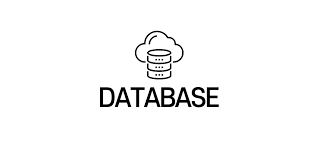

### 트랜잭션 Transaction 이란 ❓

트랜잭셕이란 데이터베이스에서 하나의 논리적 기능에서 실행되어지는 여러작업의 단위이다. 개발자중에서는 DB만을 칭하는게 아니여도 하나의 기능에서 동작하는 여러작업을 트랜잭션이라고 하는 사람도 있다. DB관점에서 트랜잭션은 크게 4가지 특징을 갖는다.

#### 1️⃣ Atomicity (원자성)

- 트랜잭션이 DB에 모두 반영되거나, 혹은 전혀 반영되지 않아야 된다.

#### 2️⃣ Consistency (일관성)

- 트랜잭션의 작업 처리 결과는 항상 일관성 있어야 한다.

#### 3️⃣ Isolation (독립성)

- 둘 이상의 트랜잭션이 동시에 병행 실행되고 있을 때, 어떤 트랜잭션도 다른 트랜잭션 연산에 끼어들 수 없다.

#### 4️⃣ Durability (지속성)

- 트랜잭션이 성공적으로 완료되었으면, 결과는 영구적으로 반영되어야 한다.

### 프로젝트 적용해보기(node.js)❗

나의 경우에 <code>node.js</code> 와 <code>express</code> 로 되있는 백엔드 프로젝트가 있었다. API 구현중에 2개 이상의 <code>DELETE</code>, <code>UPDATE</code>문을 일괄적으로 하나의 API에서 처리해야하는 경우가 생겼는데 .. 이전에는 몰라서 적용하지 못했는데, 트랜잭션을 알고나니 개선할수 있겠다 싶어서 적용해보기로 하였다.

```javascript
const db = require(path.join(root, "config/db.config"));
const log4js = require("log4js");
const logger = log4js.getLogger("access");
const log4jsConfig = path.join(root, "config/log4js.config.json");
log4js.configure(log4jsConfig);

deleteWork: async (req, res) => {
  const connection = db();
  try {
    await connection.beginTransaction(); // 트랜잭션 시작
    await connection.query(query.deleteWork(req.body)); // work 데이터 삭제
    await connection.query(query.updateWorkOrder(req.body)); // 삭제된 work 기준 order 컬럼 재정렬
    await connection.commit(); // 트랜잭션 커밋
    const [works, error] = await connection.query(query.getWorks(popolSeq)); // works 데이터 조회후 반환
    res.status(200).send(rows);
  } catch (error) {
    await connection.rollback(); // 실패시 실행됬던 쿼리문 롤백
    logger.error("deleteWork error :", error);
    res.status(500).json({
      message: "deleteWork error : 내부 서버 오류가 발생했습니다.",
      timestamp: new Date(),
    });
  } finally {
    await connection.end();
  }
};
```

이제 delete와 update의 연속된 실행에 대해 결과를 일괄적으로 보장받을수 있다😊!
