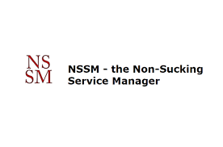

### 서비스란 ??

<code>Windows</code>에서 서비스란 **프로그램을 백그라운드로 실행, 관리 할수있도록 도와주는 도구**를 의미한다.
<code>Linux</code>에서는 <code>Daemon</code>이라는 개념도 같은 개념이라고 볼 수 있다.
<br />

---

<br />
### nssm 이란 ??
<code>nssm</code>은 <code>Non-Sucking-Service-Manager</code>의 약자로 <code>윈도우</code>에서 서비스를 추가, 수정, 삭제와 같은 관리를 할때 도와주는 도구이다.
<code>리눅스</code>가 익숙한 사람들은 <code>systemctl</code><code>systemd</code>와 같은 명령어라고 생각하면 이해하기 쉬울것이다.
<br />
---
<br />
### 사용 개요

개발환경이나 운영환경에서 필요한<code>서비스</code>는 보통 <code>리눅스</code>에서 많이 관리한다. 나의 경우에는 회사 제품중에 <code>윈도우</code> PC의 특정 디렉토리의 로그파일을 감시해서 모니터링 하는 시스템이 있었다.
개발과정에서 시뮬레이션 해보기위해 첫번째로 로그파일을 실제로 남기는것처럼 <code>윈도우</code> <code>배치파일</code>을 이용해 텍스트파일을 주기적으로 바꿔주고, <code>배치파일을</code> <code>서비스</code>로 등록해보기로 하였다.
<br />

---

<br />

### 테스트 서비스파일 생성

테스트 해볼 디렉토리에 다음과 같이 만들어 주었다.


5초마다 텍스트파일을 업데이트하는 <code>simulator.bat</code>을 아래와 같이 만들어주었다.

```batch
@echo off
setlocal enabledelayedexpansion

:: 로그 파일 설정
set "logFile=./dummy.txt"

:: 무한 루프 시작
:loop

  :: 현재 시간(초) 기준으로 로그 결정
  set /a "index=(%time:~6,2% / 5) %% 3 + 1"

  :: index를 이용해 로그 메시지 설정
  set "logMessage=!index!번째 로그"

  :: 로그 메시지를 파일에 추가
  echo !logMessage! >> "%logFile%"

  :: 5초 대기
  timeout /t 5 /nobreak >nul

goto loop
```

<br />

---

<br />

### nssm으로 윈도우 서비스 등록

- 아래 링크에서 <code>nssm</code>를 설치해준다.

  **[https://nssm.cc/download](https://nssm.cc/download){:target="\_blank"}**

   

   <br />
   <br />

- nssm 환경변수 설정

- <code>C:\Program Files</code> 경로에 <code>nssm</code> 폴더를 만들고 다운로드 받은 파일을 넣어준다.
  
  <br />
- 컴터에 사양에 맞는 <code>nssm</code> 파일을 <code>환경변수</code>에 등록해준다.
  
  <br />
  <br />

- 터미널을 열고 명령어를 입력해준다. <code>nssm install 서비스명</code>
  
  <br />
  <br />
- 서비스로 실행시킬 파일 Path, Service name 확인후 <button>Install service</button> 클릭
  
  <br />
  <br />
- 서비스 정상 등록 확인
  
  <br />
  <br />

<br />

---

<br />

### nssm 명령어 정리

추가로 <code>nssm</code>으로 자주 쓰일것 같은 명령어를 찾아봤다.

<table  class="min-width">
  <thead>
    <tr>
      <th>명령어</th>
      <th>설명</th>
    </tr>
  </thead>
  <tbody>
    <tr>
      <td>nssm start 서비스명</td>
      <td>등록된 서비스 실행</td>
    </tr>
	    <tr>
      <td>nssm stop 서비스명</td>
      <td>등록된 서비스 종료</td>
    </tr>
	    <tr>
      <td>nssm restart 서비스명</td>
      <td>등록된 서비스 재실행</td>
    </tr>
	    <tr>
      <td>nssm status 서비스명</td>
      <td>등록된 서비스 상태 확인</td>
    </tr>
	    <tr>
      <td>nssm edit 서비스명</td>
      <td>등록된 서비스 수정</td>
    </tr>
	    <tr>
      <td>nssm remove 서비스명</td>
      <td>등록된 서비스 삭제</td>
    </tr>
  </tbody>
</table>
